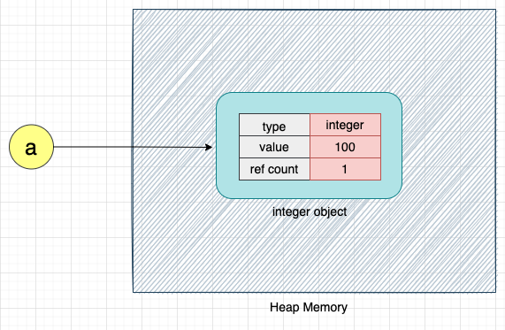

# Memory Allocation in Python
### Contents:
1.[Basic Terminologies about memory allocation](#1-basics-about-memory-management)

&nbsp; &nbsp; 1.1 [Static memory & Dynnmic memory allocation](#11-static-memory-and-dynamic-memory-allocation)

&nbsp; &nbsp; 1.2  [Stack and Heap Memory](#12-stack-and-heap-memory)

&nbsp; &nbsp; 1.3 [What is stored in Stack & Heap memory?](#13-what-is-stored-in-stack--heap-memory)

2.[Memory management in python](#2-memory-management-in-python)


---

## 1. Basics about Memory Management

### 1.1 Static memory and dynamic memory allocation
Static Memory Allocation  | Dynamic Memory Allocation
--------------------------|---------------------------
( fiexed/ constant )| (flexible)
Memory is allocated at the compile time. (When we just define a function in python and run the script it is just interpreted (or lets say compiled as a whole)) | Memory is allocated  at the execution or run time.(When we call the function with arguments or parameters then it is executed.)
Once the memory is allotted, it will remain from the beginning to end of the program. |	Here, the memory can be alloted and deallocated at any time in the program.
Memory allocation time and deallocation time is fixed. In any programming language is it done by the memory manager automatically. | Memory allocation and deallocation time is felixble. In some programming languages like Python allocation-deallocation is automatic, while in some other programming languages like C/C++ allocation-deallocation is done explicitly by the programmer.
[Stack](#basically-stack-is-a-linear-data-structure) memory is used for managing the static allocation of memory. | [Heap](#heap) memory is used for managing the dynamic allocation of memory.
It saves running time as it is fast. |	It is slower than static memory allocation.
Static memory allocation is less efficient as compared to Dynamic memory allocation.	| Dynamic memory allocation is more efficient as compared to the Static memory allocation.

 
### 1.2 Stack and Heap Memory
**Stack --> a pile of objects, that is well arraneged.**
### Basically stack is a linear data structure

- It is like a container where can add items in a linear arrangement.
- It follows FILO (First in last out) or LIFO (Last in first out)


### Heap
In plain English heap means an untidy collection of objects placed haphazardly on top of each other.**

- **untidy** -not arranged neatly and in order.

- **haphazardly** - in a manner lacking any obvious principle of organization.

**But heap memory concept has no relation to the data structure known as heap or heap tree. Heap word is used in dynamic memory allocation process as it refers to a block of memory where all data is kept unorganized.**


### 1.3 What is stored in Stack & Heap Memory
(Considering C/C++ language)

A typical memory representation of a C program consists of the following sections.

- Text segment:  stores the code instructions being executed.
- Data: Stores Initialized/ Uninitialized global variables
- Stack: stores local variables
- Heap : dynamic memory for programmer to allocate and deallocate.


###  What is stored in Stack ?
- Each time a function is called, the address of where to return to and certain information about the caller’s environment, such as some of the machine registers, are saved on the stack.
-  When a new local variables is declared, more stack memory is allocated for that function to store the variable. 

- After the function returns, the stack memory of this function is deallocated.

- **The allocation and deallocation for stack memory is done automatically.**

- The variables allocated on the stack are called stack variables, or automatic variables.

### What is stored in Heap ? 

- It depends on the programmer.
- **Heap memory is allocated explicitly by programmers and it won’t be deallocated until it is explicitly freed.**

## 2. Memory Management in Python
- **Here both static memory allocation and dynamic memory allocation are done automatically.** The programmer don't need to do dynamic memory allocation and deallocation explicitly.
- Stack is used for static memory allocation and a private heap is used for dynamic memory allocation.
- **The management of the Python heap is performed by the interpreter itself and that the user has no control over it** thats why it is called private heap, even if they regularly manipulate object pointers to memory blocks inside that heap.

- The deifnation related to allocation-deallocation time and size of static memory allocation and dynamic memory allocation is same. Only difference is in python even dynamic memory allocation is also automatic.

### How memory allocation works in Python ??
- When a variable is created, lets say ```a = 100```, it's an integer variable.
- But in python everything is an object, so, an integer is also an object
- An object has three fields associated with it - value, type, reference count.
- The value, type, reference count of an object are stored in the **private heap** memory dynamically (means when a value is assigned to it during execution or run time)
- Dynamically when the object is no more referenced then it is auto deleted by [Garbage collection](#what-is-garbage-collection) process. Python has inbuilt garbage collection method. 

- On the other side, the variable name or the reference name 'a' which is referencing to that intger object is stored in the stack memory.

- i.e., Whenever a new function or class is declared it is very common to have some variable declaration inside them, these declarations are associated with the function itself and do not change in the runtime. They occupy a fixed memory size. Hence these are stored in the stack area.


### CPython works for memory allocation 

- Python bytcode is intepreted by default implementation of Python, CPython which is written in C.
- Some other implementation of python are IronPython, Jython, PyPy.
- _.pyc file or a __pycache__ folder stores the bytecode that gets interpreted by the virtual machine.

- Python memory management algorithms and structures exist in the CPython code. 

- **CPython is based on PyObject**(grand-parent object of all other objects in python). Since C is not object oriented, from C perspective PyObject is a [struct or Structure](#structure-in-c)


### Objects in Python: 
- Everything in python is an object. Each object has 3 fields- **value, type , reference count**

- Also we can say that every object in Python is a child object of the grand object PyObject which has 2 child objects.

&nbsp; &nbsp; &nbsp; &nbsp;&nbsp;&nbsp;&nbsp;&nbsp;&nbsp;&nbsp;&nbsp;&nbsp;&nbsp;&nbsp;&nbsp;&nbsp;     1. ob_refcnt:  responsible to count how many times an object is  refrenced.

&nbsp; &nbsp; &nbsp; &nbsp;&nbsp;&nbsp;&nbsp;&nbsp;&nbsp;&nbsp;&nbsp;&nbsp;&nbsp;&nbsp;&nbsp;&nbsp; 2. ob_type: works as a pointer to the type of the object.

- We can check the reference count for a simple list object as follow.
```
import sys
a = []  # 'a' is list object. 'a' is just created so reference count = 1
b = a   # a is referenced here so count = 2
a.append(2)
sys.getrefcount(a)   #a is referenced again so count = 3
```
Output of the above program = 3

### How Cpython works for memory allocation and deallocation

- When we create a variable lets say ```a =100```, CPython internally creates an object of type integer. The variable 'a' points to this integer object as shown below:



- If we do the following 
```
b = a 
a = a+1 
```
This will happen 


- Here, we can see that instead of overwriting the value of 100 with 101, CPython creates a new object with the value 101 because integers in Python are [immutable](#immutable-and-mutable-objects).

- Each time int variable 'a' is incremented CPython will create a new integer object and new memory space will be allocated. At the same time since the previous integer objects are no more referenced so their space will be deallocated using garbage collection process.

- The reference count object ```ob_refcnt``` is used for [garbage collection](#what-is-garbage-collection), i.e, to free the memory when reference count reaches to $ 0 $.
- CPython it uses the [GIL](#gil-global-interpreter-lock) to ensure shared memory operations without any conflicts.


---
#### External References

### [Immutable and Mutable Objects](/MemoryAllocation/memoryAllocationExamples.ipynb)

**Immutable**: An immutable object is an object whose value cann't be changed.

E.g: booleans, integers, floats, strings, and tuples.

**Mutable**: A mutable object is an object whose value can be changed

E.g: lists, dictionaries, sets, user defined classes.

### Structure in C
- A struct, or structure, in C is a custom data type that groups together different data types. To compare to object-oriented languages, it’s like a class with attributes and no methods.

### What is garbage collection 
- Garbage collection (GC) is a memory recovery feature built into programming languages such as C and Java. A GC-enabled programming language includes one or more garbage collectors (GC engines) that automatically free up memory space that has been allocated to objects no longer needed by the program.

### GIL (Global interpreter lock)
The Global Interpreter Lock (GIL)
The python interpreter has a multi-threaded model. It means that there can be more than one function executing parallel with each other. This brings into attention one of the biggest problem in computation, the concurrency.

Suppose two threads execute in parallel under the python interpreter, what happens when both these threads try to access the same memory location and at the same time. The result is called a race-around condition, where the output is completely unpredictable, and of no use.

To get around this problem of concurrency the python interpreter uses a concept called Global Interpreter Lock. The GIL locks the interpreter for one thread accessing a critical part of memory, while the lock is acquired no other thread can access the interpreter let alone perform any memory operations.

In CPython, the GIL is used to perform shared memory operations without any conflicts.

[Know more about GIL](https://realpython.com/python-gil/)
